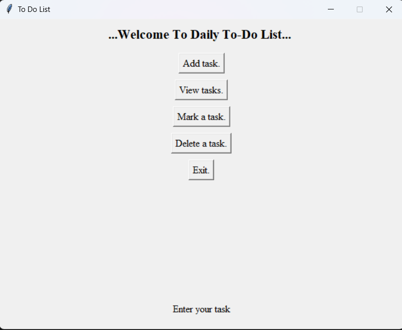
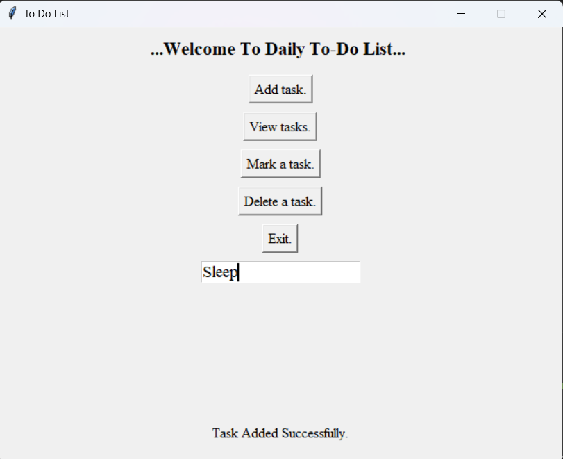
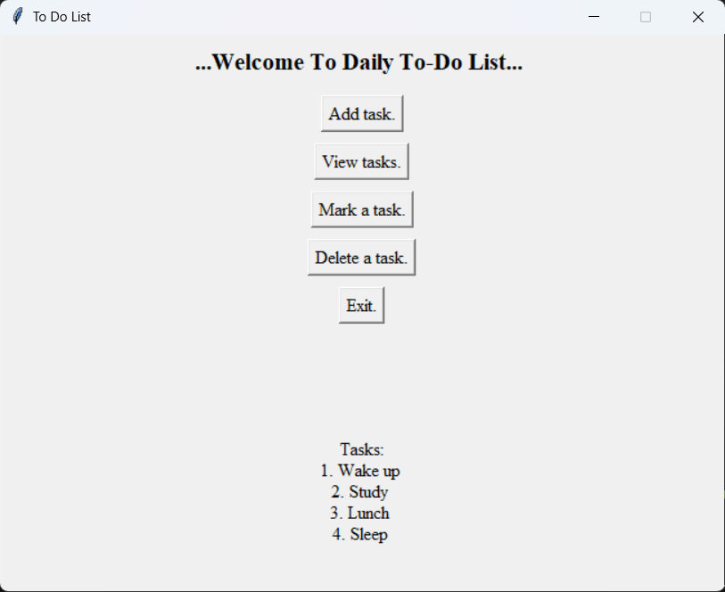
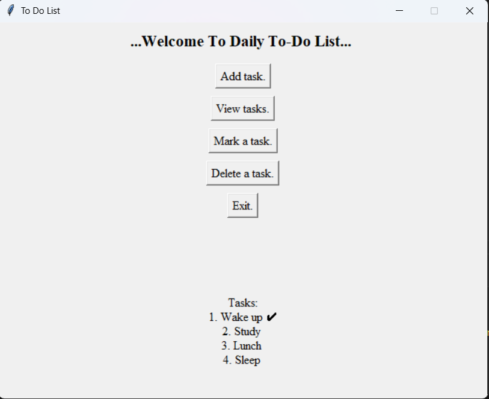

📝 Daily To-Do List (Tkinter GUI)

A simple and user-friendly desktop To-Do List application built using Python and Tkinter.
This project demonstrates GUI development, structured data handling, and basic task management functionality.

## 📌 Overview

The Daily To-Do List application allows users to:

Add new tasks

View all existing tasks

Mark tasks as completed

Delete tasks

Exit the application

The project uses a structured data model where each task is stored with its completion status.

## 🛠 Tech Stack

Language: Python 3

GUI Library: Tkinter (built-in with Python)

No external dependencies are required.

## 🧠 Application Logic

Tasks are stored in memory using the following structure:

tasks_lst = [
    ["Study Python", False],
    ["Complete Homework", True]
]

Where:

task[0] → Task name (String)

task[1] → Completion status (Boolean)

False → Not completed

True → Completed

The ✔ symbol is dynamically displayed in the UI when a task is marked complete.

## 🚀 Features

✔ Add Tasks
✔ View Tasks
✔ Mark Tasks as Completed
✔ Delete Tasks
✔ Simple and Clean GUI Interface
✔ Structured Data Handling

## ▶ Getting Started
1️⃣ Prerequisites

Python 3.x installed

To check your Python version:

python --version
2️⃣ Running the Application

Download or clone the repository

Navigate to the project directory

Run the following command:

python to_do_list.py

The application window will open.

## 🎮 How to Use
Action	Description
Add Task	Click Add Task, enter task name, task is saved
View Tasks	Displays all tasks with completion status
Mark Task	Enter exact task name to mark it complete
Delete Task	Enter exact task name to remove it
Exit	Closes the application

## Preview

  
  
  
  

## ⚠ Limitations

Tasks must be typed exactly when marking or deleting.

Data is stored only in memory.

Tasks are not saved after closing the application.

## 🔮 Future Enhancements

Persistent storage using JSON or text file

Task selection by number instead of name

Improved UI using Listbox widget

Add due dates and priority levels

Add task categories

Dark mode UI theme

🎯 Learning Outcomes

This project demonstrates:

GUI development with Tkinter

Event-driven programming

List-based data modeling

Boolean state management

Proper loop and function control flow

👨‍💻 Author

Souvik Banerjee
Python Developer | Computer Science Student