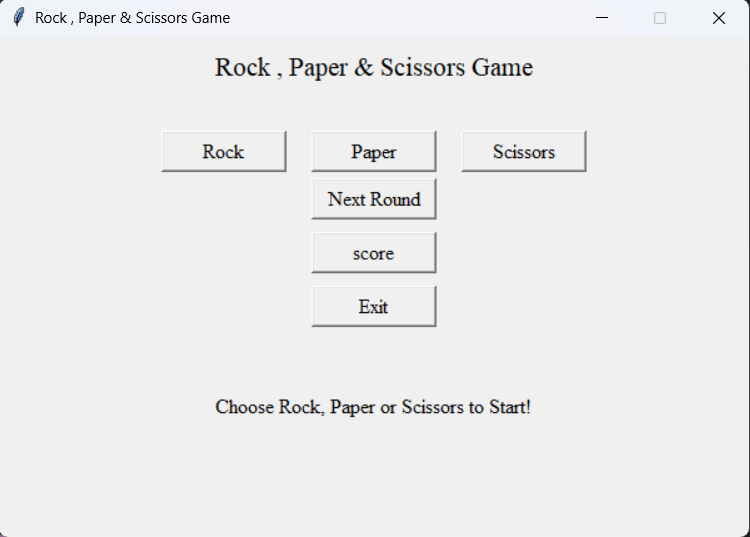
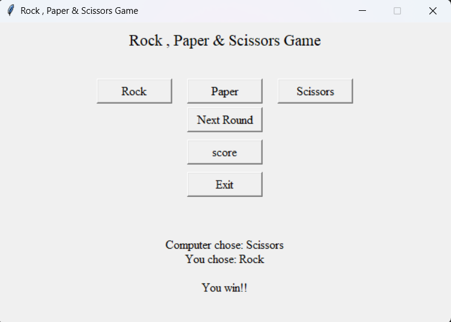
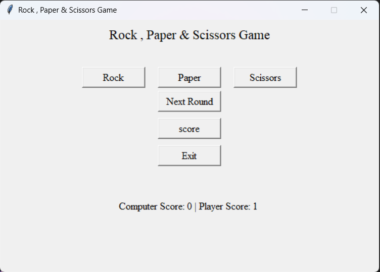

## Rock, Paper & Scissors – Python GUI Game

A simple Rock, Paper & Scissors desktop game built using Python and Tkinter.
The player competes against the computer, and scores are tracked during the game.

# This project demonstrates basic concepts of:

- Python GUI development with Tkinter

- Event-driven programming

- Random choice generation

- Simple game logic

## Features

- Simple and clean Tkinter GUI

- Play against the computer

- Random computer moves

- Score tracking for player and computer

- Next Round option

- Exit button to close the game

## Built With

- Python

- Tkinter (built-in Python GUI library)

- Random module

## How the Game Works

Choose Rock, Paper, or Scissors.

The computer randomly selects its move.

The winner is decided using classic rules:

### Player , Computer --> Result

Rock , Scissors	--> Player Wins

Paper , Rock --> Player Wins

Scissors , Paper --> Player Wins

Same_choice , Same_choice --> Draw

- #### Scores update automatically.

- Click Next Round to play again.

### Run the Project

1️⃣ Clone the repository

git clone: https://github.com/Souvik-005/CODSOFT

2️⃣ Navigate to the project folder

cd rock-paper-scissors-game

3️⃣ Run the game

python app.py

## Preview

  
  <h3> After Click on Rock option: </h3>
  
  <h3> After Click on Score: </h3>
  

## Learning Purpose

This project is useful for beginners who want to learn:

- GUI programming with Tkinter

- Python game logic

- Event handling

- Managing state variables

## Future Improvements

### Possible upgrades:

- Add icons for rock, paper, scissors

- Add sound effects

- Show live score on the GUI

- Add best-of-5 or best-of-10 rounds

- Improve UI styling

## Author

Souvik Banerjee
Computer Science Student | CSE | Python